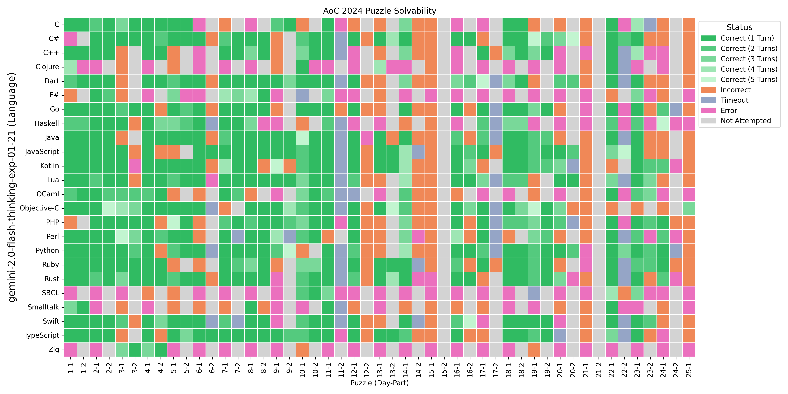
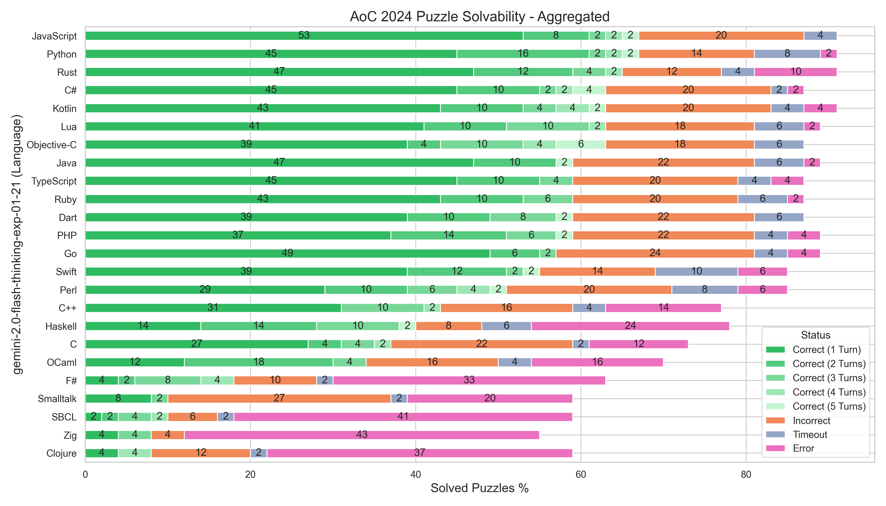
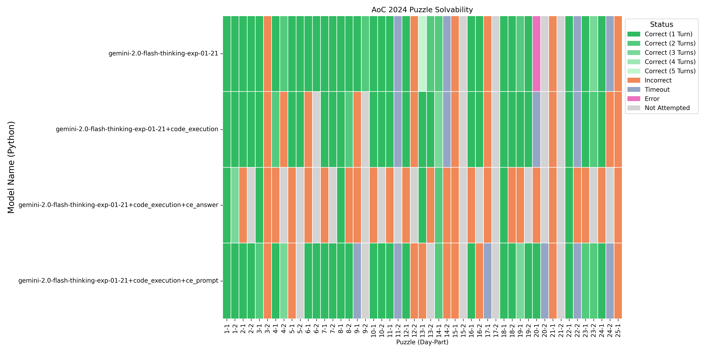

# Using a Gemini Thinking Model to Solve Advent of Code 2024 Puzzles in Multiple Languages

jack.palevich@gmail.com

February 3rd, 2025

## Abstract

The Advent of Code is a yearly programming contest made up of Christmas-themed puzzles designed to be solved using any programming language. This paper measures how well the gemini-2.0-flash-thinking-exp-01-21 LLM solves the 2024 contest puzzles.

A prompt was developed to guide the model in a multi-turn conversation. The model is given 5 conversational turns to produce a correct puzzle solution.

Results: 24 popular programming languages were measured. Depending on the programming language used, the model is capable of solving from a high of 69% to a low of 8% of the puzzles.

The model optionally supports code execution of Python programs. Enabling code execution results in poorer performance. The solve rate with no code execution: 69%, code execution of examples: 59%, code execution of examples and the actual puzzle input: 16%.


## Introduction

The Advent of Code[@wastl_adventofcode] is programming contest held annually during the first 25 days of December. A total of 25 puzzles are released, one a day. Each puzzle has two parts, except for the final day, which has just one part. The puzzles vary in difficulty. Early-day puzzles and weekday puzzles tend to be easier than later-day and weekend puzzles. The second part of a puzzle cannot be attempted until the first part is solved. The second part is sometimes significantly more difficult than the first part. Although the puzzles are typically solved using Python [@wastl_adventofcode_keynote_2022], contestants are permitted to use any process they wish to solve the puzzles.

This paper measures how well the Google Gemini 2.0 Flash Thinking EXP 01-21 LLM can can solve Advent of Code puzzles. To successfully solve an Advent of Code puzzle, a LLM must understand potentially ambiguous instructions, select an algorithm, generate valid Python code, and debug any errors, timeouts or incorrect answers in the resulting program.

## Methodology

### Models Tested

I tested the Google Gemini 2.0 Flash Thinking EXP 01-21 model. This model was chosen because it is representaive of recent reasoning models and Google provides a public API for accessing the model with a generous free quota.

### Programming Languages Tested

While Python is the most common language used to solve Advent of Code puzzles, many other languages are commonly used. I chose to test the following languages. In each case, the runtime for the language was installed on the test machine (a Macbook Pro running MacOS 15.3).


| Language    | Version                          |
| ----------- | ------------------------------ |
| C           | clang 16.0.0                   |
| C#          | dotnet 9.0.102                 |
| C++         | clang 16.0.0                   |
| Clojure     | 1.12.0.1495                    |
| Common Lisp | SBCL 2.5.0                     |
| Dart        | 3.6.1 (stable)                 |
| F#          | dotnet 9.0.102                 |
| Go          | go1.23.5                       |
| Haskell     | ghc 9.4.8                      |
| Java        | javac 23.0.1                   |
| JavaScript  | node v22.13.0                  |
| Kotlin      | kotlinc-jvm 2.1.0 (JRE 23.0.1) |
| Lua         | Lua 5.4.7                      |
| Objective-C | clang 16.0.00                  |
| OCaml       | 5.2.1                          |
| Perl        | v5.34.1                        |
| PHP         | 8.4.3                          |
| Python      | 3.13.1                         |
| Ruby        | 2.6.10p210                     |
| Rust        | cargo 1.84.0                   |
| Smalltalk   | GNU Smalltalk                  |
| Swift       | clang 16.0.0                   |
| TypeScript  | 5.7.3                          |
| Zig         | 0.13.0                         |

### Experimental Setup

I used the google.generativeai Python API to access the model.

All model parameters (such as temperature) were left at their default values.

It took about 12 hours of wall-clock time to gather this experimental data.

Each language took between 49 and 245 conversation turns to test. 49 is the best case if every puzzle is solved correctly on the first try. 5*49 == 245 is the worst case, if every puzzle takes 5 turns to solve.

At the time the experiment was run, Google was providing generous free quota limits for testing out their latest models.

| Model                               |   Free Quota Limits |
| ----------------------------------- | ------------------: |
| gemini-2.0-flash-thinking-exp-01-21 | 1500 requests / day |

The experiment data was collected from 2025-01-31 to 2025-02-03. The start date was chosen to avoid polluting the contest leaderboard with LLM-generated results. Only year 2024 puzzles were tested to reduce the likelihood that the puzzles and their solutions would be in the training set of the LLM. Google reports that the knowledge cutoff date for Gemini Flash Thinking 2.0 is August 2024.

The [Advent of Code Data](https://pypi.org/project/advent-of-code-data/) library was used to manage a local cache of puzzle instructions, input, and answer data. This minimized the load on the Advent of Code contest infrastructure.

Puzzles were executed one at a time. For each (model, puzzle) tuple, the puzzle solving process was a loop:

```python
if part == 2:
    preload_conversation(year,day,1) # preload the existing part 1 conversation
prompt = initial_prompt(puzzle_instructions(year,day,part))
for turn in range(5):
    response = conversation_turn(prompt)
    program = parse_program_(response)
    results = check_answer(run_program(program))
    if success(results):
        break
    else:
        prompt = incremental_prompt(results)
```

The limit of 5 conversation turns was chosen by trial and error during development. It was common for a LLM to need 3-to-5 turns to solve a puzzle. The first turn might result in a syntax error, the second in an input parsing runtime error, the third in a timeout, the fourth is an incorrect answer, and so on.

## Results

### Comparing Language Performance

When comparing model performance using different languages, it is useful to distinguish between the different ways that a program might fail to generate the correct answer:

| Status        | Meaning                                                                                   |
| ------------- | ----------------------------------------------------------------------------------------- |
| correct       | The program generated by the LLM produced the correct answer within 5 conversation turns. |
| incorrect     | On the 5th turn, the program generated by the LLM produced an incorrect answer.           |
| timeout       | On the 5th turn, the program generated by the LLM ran for more than 30 seconds.           |
| error         | On the 5th turn, the program failed with either a syntax error or a runtime error.        |
| not attempted | The puzzle was not attempted due to part 1 of the same puzzle not being solved correctly. |

Note that there are 49 possible puzzles, which is why the percentages shown are not even.





### General Observations

The model was run at its default temperature, which introduced variations in results over repeated runs. The model might succeed in solving a given puzzle on one run, but fail on another run. Keep in mind that the reported numbers could change +/- 2 puzzles if the same experiment were performed again. Therefore don't take the details of language ranking too seriously. Another run could well flip the positions of any two nearby languages.

### Puzzle-Specific Observations

Some puzzles were particularly hard for the model. The following puzzles not solved by any language:

| Day-Part | Notes                                                                  |
| -------- | ---------------------------------------------------------------------- |
| 6-2      | Ambiguous instructions.                                                |
| 12-2     | Ambiguous instructions, domain knowledge of corner-counting algorithm. |
| 14-2     | Ambiguous instructions.                                                |
| 15-1     | Difficult simulation.                                                  |
| 15-2     | Not attempted because no experiment solved precursor 15-1.             |
| 17-2     | Couldn't brute force. Required thinking outside of the box.            |
| 21-1     | Ambiguous instructions, performance issues with naive solution.        |
| 21-2     | Not attempted because no experiment solved precursor 21-1.             |
| 24-2     | Required thinking outside of the box to solve in reasonable time.      |

FWIW these puzzles were difficult for humans to solve, too.

### Language-Specific Observations

When interpreting the language rankings, keep in mind that the model has a non-zero temperature, so results vary from run to run.
Any two languages that are within a few percent of each other on the chart could swap positions in subsequent runs.

We see that a large number of languages have roughly the same solution rate. For these languages the model is capable of rendering a given algorithm in that language. These include C#, Dart, Go, Java, JavaScript, Kotlin, Lua, Objective-C, PHP, Python, Ruby, Rust, Swift, and TypeScript.

Python and Rust are the two most popular languages used by Advent of Code participants. This may explain why Rust fares so well.

Many less popular languages suffer from a large number of "errors", which covers any compile-time or runtime error such as a synax error or a type error, or a memory fault.

The C language suffers from memory issues. The model doesn't use dynamic data structures (even when prompted), and can't debug the resulting memory access errors. C++ fares better due to the standard library of common data structures.

Haskell suffers from a dialect problem, as the model tries to use language features without properly enabling them.

The Lisps (SBCL and Clojure) suffer from paren mis-matches and mistakes using standard library functions.

Smalltalk suffers from calling methods that are not available in the specific Smalltalk dialect being used.

Zig code generation suffers from confusion over whether variables should be declared const or non-const. The model has trouble interpreting the Zig compiler error messages, which seem to give errors relative to the function start, rather than relative to the file start.

## In-Model Code Execution

The Gemini model supports code execution. When this feature is enabled, the model is able to construct and execute small Python programs during the conversation. I tested this feature three different ways.



The 4 variations of the model tested were:

| Suffix         | Solvability |
| -------------- | ----------: |
| none           |         69% |
| code_execution |         59% |
| ce_prompt      |         57% |
| ce_answer      |         16% |

The `code_execution` version simply enabled code execution, without any additional prompts.

The `ce_prompt` version enabled code execution, but also explicitly prompted the model to use code execution to test whether the generated program produced the correct answer on the example input.

The `ce_answer` version was a complete rewrite of the prompt, to include the actual puzzle input, and to request that the model produce the answer for the given input, rather than a program to be run.

The  `code_execution` and `ce_prompt` were similar enough that the difference may just be noise. Surprisingly, the results or using code execution was clearly worse than not using code execution. This may be because the model became too confident in its reasoning, given that it succeeded in solving the example input.

The `ce_answer` result was particularly poor. One reason appears to be that the model may have trouble properly parsing and using the actual puzzle input, which was often in the form of a very large batch of numbers or a large character grid.

## Discussion

Advent of Code puzzles are not necessarily representative of general coding problems. They are stylized, and their instructions are written with enjoyable but potentially distracting Christmas-themed details. On the other hand, the puzzle descriptions are extensively tested during development. This leads to specs that contain a lot of useful details.

This year's puzzles were weighted towards 2D grid problems. Model performance may have been affected by that.

### Directions for future work

The experiment could be continued, both to produce error bars for the existing measurements and to measure additional languages and models.

The experiment framework does not handle quota exhaustion as efficiently as it could. It currently throws away the entire conversation for the current puzzle. It would be more efficient to preserve the existing conversation, to be resumed when quota is available.

Would asking the models to generate typed Python help catch syntax errors?

When a model gets stuck in a rut, would asking the model to start over help?

It would be interesting to develop a heuristic for how many turns to give a model to solve a problem, perhaps based on the progress the model is making towards solving the problem, as measured by changes to the generated code and computed answer.

Most Advent of Code puzzles can be easily solved if you take the right approach. It might be possible to split the puzzle solving into a search for the right approach followed by a separate prompt series to implement the right approach.

## Conclusion

Because this evaluation is relatively quick and inexpensive to run, and because it produces a wide range of scores for different languages and code execution modes, it could serve as a useful benchmark for evaluating model performance, now and for the next few years.

## References

* **Wikipedia contributors**. (2025). *Large Language Model*. [Online; accessed 4-January-2025]. Available: [https://en.wikipedia.org/w/index.php?title=Large_language_model&oldid=1267032005](https://en.wikipedia.org/w/index.php?title=Large_language_model&oldid=1267032005)
* **Wastl, E.** (2015--present). *Advent of Code*. [Online]. Available: [https://adventofcode.com](https://adventofcode.com)
* **Wastl, E.** (2024). *About Advent of Code*. [Online]. Available: [https://adventofcode.com/2024/about](https://adventofcode.com/2024/about)
* **Wastl, E.** (2022). *Keynote: Advent of Code, Behind the Scenes*. [YouTube; Accessed: 2025-01-02]. Available: [https://www.youtube.com/watch?v=uZ8DcbhojOw](https://www.youtube.com/watch?v=uZ8DcbhojOw)
* **Glenn, W.** (2023). *advent-of-code-data*. GitHub repository. Available: [https://github.com/wimglenn/advent-of-code-data](https://github.com/wimglenn/advent-of-code-data)
* **Gemini Team et al.** (2024). *Gemini: A Family of Highly Capable Multimodal Models*. arXiv:2312.11805 \[cs.CL]. Available: [https://arxiv.org/abs/2312.11805](https://arxiv.org/abs/2312.11805)
